## Tahap 3: Studi Kasus Implementasi (Materi 10)

Pada tahap ini, studi kasus implementasi difokuskan pada fitur **Booking Personal Trainer** pada prototipe sistem berbasis web BisaBugar. Fitur ini dipilih karena merupakan salah satu fitur inti yang secara langsung mendukung kebutuhan utama pengguna, yaitu melakukan pemesanan sesi latihan dengan pelatih secara terjadwal. Selain itu, fitur ini melibatkan alur bisnis yang relatif kompleks, seperti pemilihan pelatih, validasi status keanggotaan, pengecekan ketersediaan jadwal, penyimpanan data booking, serta pemberian umpan balik kepada pengguna. Dengan kompleksitas tersebut, fitur Booking Personal Trainer menjadi studi kasus yang tepat untuk menunjukkan bagaimana integrasi pola desain dan arsitektur sistem mampu mengelola logika bisnis tanpa membebani antarmuka pengguna.

Proses desain fitur Booking Personal Trainer dimulai dari analisis alur interaksi pengguna pada lapisan antarmuka. Pengguna membuka modal booking, memilih pelatih dari dropdown yang telah disesuaikan dengan tema aplikasi, menentukan waktu sesi, dan melakukan konfirmasi. Dari sisi arsitektur, logika pemrosesan booking tidak ditempatkan langsung pada komponen UI untuk menghindari ketergantungan yang tinggi dan kompleksitas yang sulit dikelola. Sebaliknya, UI hanya berperan sebagai pemicu proses, sedangkan seluruh orkestrasi logika bisnis ditempatkan pada lapisan aplikasi. Pendekatan ini selaras dengan rancangan arsitektur berbasis komponen pada C4 Model, di mana UI Layer bertugas mengirimkan permintaan, dan Application Layer bertanggung jawab terhadap koordinasi proses serta penerapan aturan bisnis.

Tantangan teknis utama dalam pengembangan prototipe ini adalah keterbatasan infrastruktur backend yang masih bersifat simulatif. Sistem belum terhubung dengan database nyata, sehingga penyimpanan dan pengelolaan data booking harus disimulasikan menggunakan localStorage. Kondisi ini menimbulkan tantangan dalam menjaga konsistensi data serta sinkronisasi state antar komponen, khususnya setelah halaman dimuat ulang. Selain itu, penggunaan Astro yang mendukung server-side rendering menuntut penanganan khusus agar akses localStorage hanya dilakukan pada sisi client. Tantangan lain juga muncul dari penggunaan Svelte versi terbaru, yang memerlukan adaptasi terhadap mekanisme reaktivitas baru untuk memastikan pembaruan UI berjalan secara konsisten.

Untuk mengatasi tantangan tersebut, solusi yang diterapkan mengintegrasikan tiga pola desain utama yang telah dirancang pada tahap sebelumnya. **Singleton Pattern** diimplementasikan melalui DatabaseManager untuk memastikan bahwa pengelolaan data booking dilakukan melalui satu instance terpusat, sehingga konsistensi data tetap terjaga meskipun diakses oleh berbagai komponen. **Facade Pattern** diwujudkan dalam BookingFacade yang bertindak sebagai antarmuka tunggal antara UI dan subsistem internal, sehingga seluruh proses booking—mulai dari validasi keanggotaan, pengecekan jadwal, hingga penyimpanan data dan pemicu notifikasi—dapat dijalankan melalui satu pemanggilan metode. **Observer Pattern** diterapkan melalui EventBus untuk mendukung komunikasi berbasis event, di mana perubahan status booking akan memicu pembaruan UI dan notifikasi secara otomatis tanpa menciptakan ketergantungan langsung antar komponen.

Implementasi fitur Booking Personal Trainer ini sepenuhnya selaras dengan arsitektur sistem yang telah dirancang menggunakan pendekatan C4 Model dan Process View. UI Layer berinteraksi dengan Application Layer melalui BookingFacade sebagai titik masuk utama. Pada Process View, alur booking dimulai dari aksi pengguna di UI yang memanggil metode pada facade, kemudian facade mengoordinasikan Business Logic Layer dan Data Layer untuk memproses dan menyimpan data. Setelah proses selesai, mekanisme Observer memastikan bahwa notifikasi dan pembaruan tampilan terjadi secara reaktif. Pendekatan ini menghasilkan pemisahan tanggung jawab yang jelas antar lapisan, meningkatkan kemudahan pemeliharaan, serta mempersiapkan sistem untuk dikembangkan lebih lanjut menuju implementasi backend nyata di masa depan.

## Diagram Arsitektur Booking Personal Trainer

```mermaid
graph TB
    subgraph "UI/Frontend Layer"
        UI[Booking Modal UI]
        Dropdown[Coach Dropdown]
        Form[Booking Form]
    end
    
    subgraph "Application Layer"
        Facade[BookingFacade<br/>Facade Pattern]
    end
    
    subgraph "Business Logic Layer"
        Validator[Membership Validator]
        Checker[Schedule Checker]
    end
    
    subgraph "Data Layer"
        DBManager[DatabaseManager<br/>Singleton Pattern]
        Storage[(localStorage)]
    end
    
    subgraph "Infrastructure Layer"
        EventBus[EventBus<br/>Observer Pattern]
        Notification[Toast Notification]
    end
    
    UI --> Facade
    Dropdown --> UI
    Form --> UI
    
    Facade --> Validator
    Facade --> Checker
    Facade --> DBManager
    Facade --> EventBus
    
    Validator --> DBManager
    Checker --> DBManager
    DBManager --> Storage
    
    EventBus --> Notification
    EventBus --> UI
    
    style Facade fill:#ff9999
    style DBManager fill:#2f3542
    style EventBus fill:#99ff99
```

