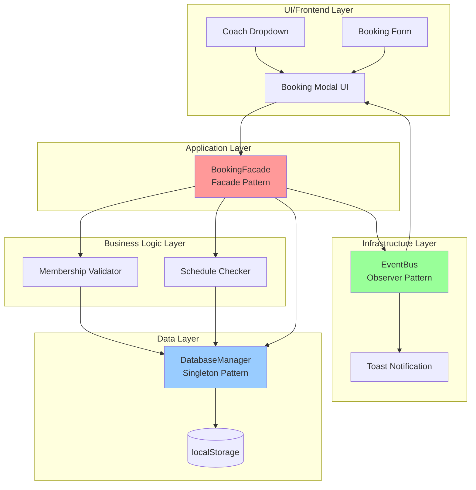

# Tahap 3: Studi Kasus Implementasi Fitur Booking Personal Trainer

## Implementasi Naratif

Fitur Booking Personal Trainer dipilih sebagai studi kasus implementasi karena merupakan komponen krusial yang mengintegrasikan berbagai aspek sistem BisaBugar, mulai dari interaksi pengguna hingga manajemen data. Fitur ini merepresentasikan kompleksitas bisnis gym yang sesungguhnya, di mana pengguna perlu memilih pelatih, jadwal, dan melakukan konfirmasi booking dengan validasi keanggotaan. Sebagai fitur utama yang menjadi nilai tambah platform, Booking Personal Trainer menunjukkan bagaimana arsitektur sistem dapat mengakomodasi alur bisnis yang kompleks sambil tetap menjaga konsistensi dan skalabilitas. Implementasi fitur ini juga menjadi tolok ukur keberhasilan penerapan pola desain yang telah dirancang, karena melibatkan multiple subsystem yang harus bekerja secara terkoordinasi.

Proses desain fitur Booking Personal Trainer dimulai dari analisis alur pengguna yang diawali dengan interaksi pada antarmuka modal booking. Pengguna memilih pelatih favorit dari dropdown yang telah distyling sesuai tema aplikasi, kemudian sistem melakukan validasi keanggotaan secara simulatif. Logika pemrosesan booking dikelola oleh BookingFacade yang berfungsi sebagai antarmuka tunggal bagi UI untuk mengakses berbagai subsistem. Facade ini mengoordinasikan Membership Validator untuk memeriksa status keanggotaan, Schedule Checker untuk memastikan ketersediaan slot, dan DatabaseManager untuk menyimpan data booking. Setiap tahapan proses dipisahkan dengan jelas untuk memastikan single responsibility principle terpenuhi dan memudahkan pengujian serta pemeliharaan sistem di masa mendatang.

Tantangan teknis utama yang muncul pada pengembangan prototipe adalah keterbatasan infrastruktur backend yang masih bersifat simulatif. Sistem mengandalkan localStorage sebagai database tiruan, yang memunculkan tantangan dalam hal konsistensi data dan sinkronisasi state antar komponen. Selain itu, terdapat kendala terkait server-side rendering pada Astro yang tidak mendukung akses localStorage, sehingga perlu dilakukan penanganan khusus untuk memastikan kode hanya dieksekusi pada client-side. Tantangan lainnya adalah implementasi reactive state management pada Svelte 5 yang memerlukan adaptasi sintaks baru seperti $props() dan $effect() untuk menggantikan pola lama yang tidak lagi didukung.

Solusi yang diterapkan mengintegrasikan tiga pola desain utama untuk mengatasi tantangan tersebut. Singleton Pattern diimplementasikan melalui DatabaseManager yang memastikan hanya ada satu instance pengelola data di seluruh sistem, sehingga konsistensi data terjaga meskipun diakses dari berbagai komponen. Facade Pattern diwujudkan dalam BookingFacade yang menyederhanakan kompleksitas alur booking menjadi satu panggilan method, sehingga UI tidak perlu mengetahui detail implementasi subsistem. Observer Pattern diterapkan melalui EventBus untuk mendukung sistem notifikasi real-time, di mana setiap perubahan state booking akan memicu update otomatis pada UI komponen yang berlangganan event tersebut.

Implementasi fitur Booking Personal Trainer sesuai dengan arsitektur C4 Model yang telah dirancang, di mana UI Layer berinteraksi dengan Application Layer melalui BookingFacade. Pada Process View, alur booking dimulai dari UI trigger yang memanggil BookingFacade.bookClass(), kemudian facade mengoordinasikan DatabaseManager untuk validasi data dan EventBus untuk notifikasi. Arsitektur ini memastikan pemisahan tanggung jawab yang jelas antara presentasi logic dan business logic, serta memungkinkan evolusi sistem menuju backend nyata tanpa perubahan signifikan pada UI layer. Pendekatan ini juga memfasilitasi pengujian unit yang lebih mudah karena setiap komponen dapat diuji secara terisolasi sesuai dengan tanggung jawabnya masing-masing.

## Diagram Arsitektur Booking Personal Trainer

## Penjelasan Diagram

Diagram arsitektur di atas menggambarkan alur kerja fitur Booking Personal Trainer dengan menunjukkan interaksi antar komponen yang menerapkan pola desain yang telah dirancang. UI Layer berkomunikasi dengan BookingFacade sebagai titik masuk tunggal, yang kemudian mengoordinasikan Membership Validator dan Schedule Checker untuk validasi bisnis. DatabaseManager sebagai Singleton memastikan konsistensi data melalui localStorage, sementara EventBus sebagai Observer memfasilitasi komunikasi event-driven untuk notifikasi real-time. Arsitektur ini memisahkan tanggung jawab secara jelas, di mana setiap layer memiliki fungsi spesifik namun tetap terintegrasi secara kohesif untuk mendukung alur booking yang kompleks namun tetap maintainable.
